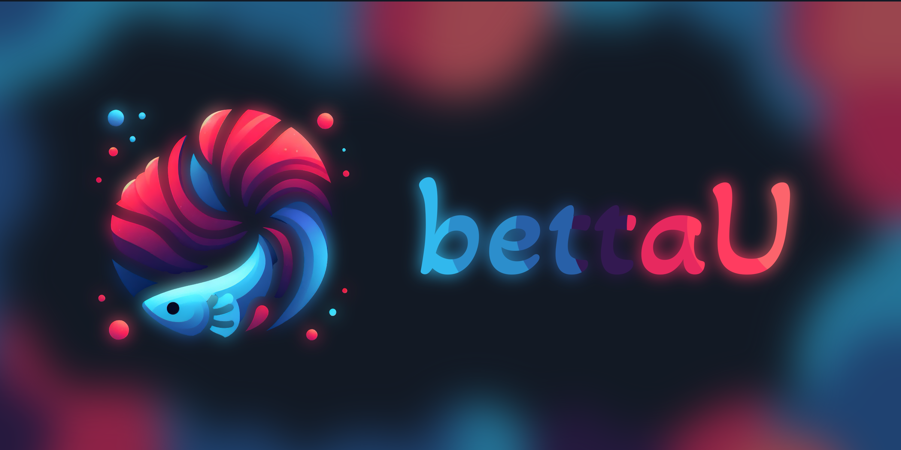

# bettaU - AI Language Learning CLI



> [!IMPORTANT]
> bettaU uses ChatGPT and you need an OpenAI API key to use it.

> [!IMPORTANT]
> bettaU is more of a proof of concept than a ready-to-use tool, but if you're not looking for much, it works.

# Overview

bettaU is a simple CLI that uses AI to help you learn a new language. You provide it with sentences in English - as a yaml file - and you're prompted to translate them into the language you're learning.

The idea is that you're forced to translate whole sentences - unlike e.g. Clozemaster - and that you're more flexible with your answers and you're answers don't get rejected because you're using a synonym that other tools don't know of.

An example yaml file can look like this:

```yaml
name: Swedish
contents:
  - She reads books every night.
  - He plays guitar after school.
```

`name` should be the name of the language you're learning - it's used by ChatGPT. Don't just set it to anything.

Notice that you don't have to provide the translations - bettaU will prompt you to translate the sentences and check the result using ChatGPT.

# Usage

To learn a deck - which is simply a yaml file, as shown above - run:

```bash
export TOKEN=<your openai token>

go run bettau.go learn <path to deck> # e.g. test-decks/swedish.yaml
```

Sentences will be chosen randomly. There is no spaced repition etc. - it's just a proof of concept / prototype. Reason is mostly that it's hard to gather sentences classified into different difficulty levels - I don't know where to get the data. Tatoeba has a lot of sentences, but they're not classified by difficulty.
